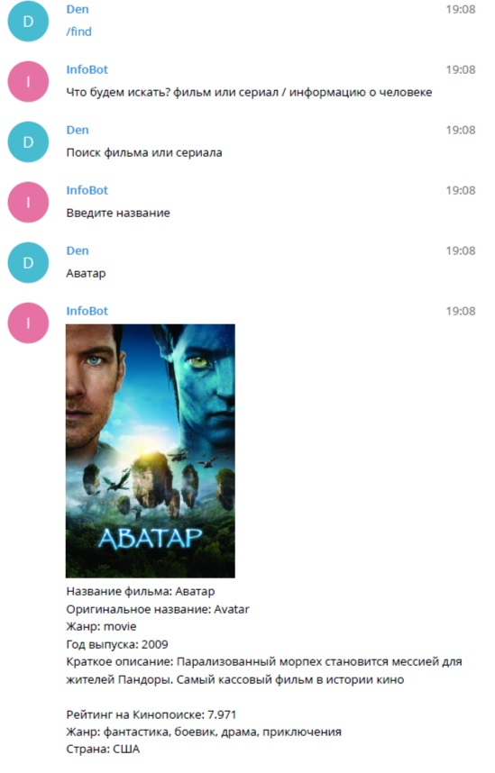

##  Проект реализации запросов по фильмам, сериалам и медийным личностям (актер, режиссер)
### Данный проект реализован через API запрос [kinopoisk.dev](https://api.kinopoisk.dev/v1/documentation)
1. Реализация запросов в файлах *utils/get_movies_by_name* (запрос фильмов и сериалов) и *utils/get_person_by_name* (зпрос личности)
2. Запросы обрабатываются командой */find* реализованной в *handlers/default_handlers/find.py* -> **reply** кнопками *keyboards/reply/button_find.py*
3. После чего происходит обработка комант текста *handlers/custom_handlers/search.py*
4. Одинаковые запросы кешируются по средством [Redis](https://redis.io/) в *database/api_db.py* и дообробатываются в выгрузке в текст *utils/send_movie_info.py* и *utils/send_person_info.py*
	> *P.S.*   
	> в коде print(search.text, 'inf * on cache') показывается откуда берется информация.  
	> Пример записей в Run:  
	>> Терминатор 2 inf movie on cache  
	>> Аватар inf movie on api  
	>> Аватар inf movie on cache  
	>> Шварценеггер inf person on api  
	>> Шварценеггер inf person on cache  
	>> Мила Йовович inf person on api  
---
**Для корректной работы должен быть установлен [Redis](https://redis.io/) на ваш РС, сброс кеша выполняется по средством терминала, командой:** ***redis-cli flushall*** **(удалить ключи из всех баз данных Redis)**

---
### Пример работы бота:  

